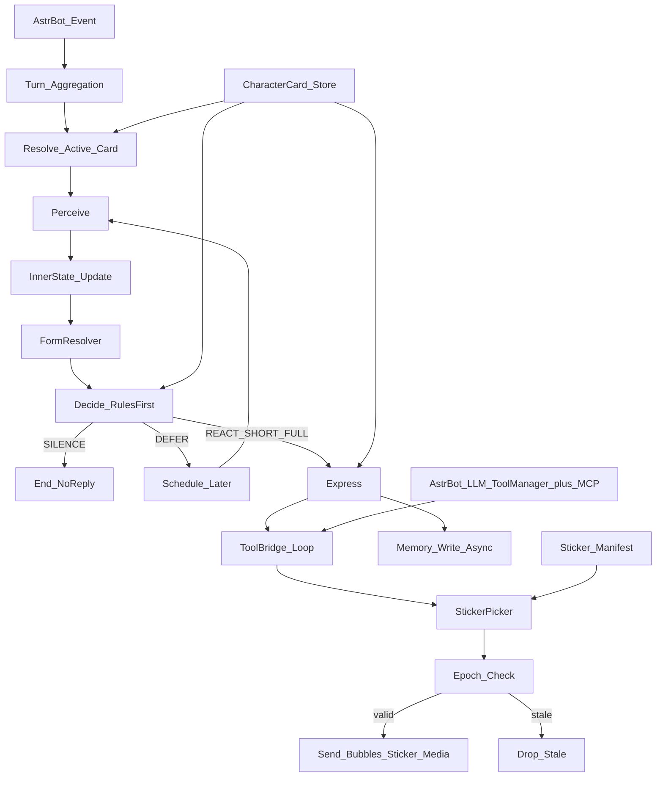
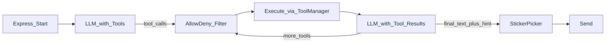
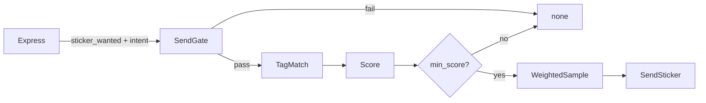
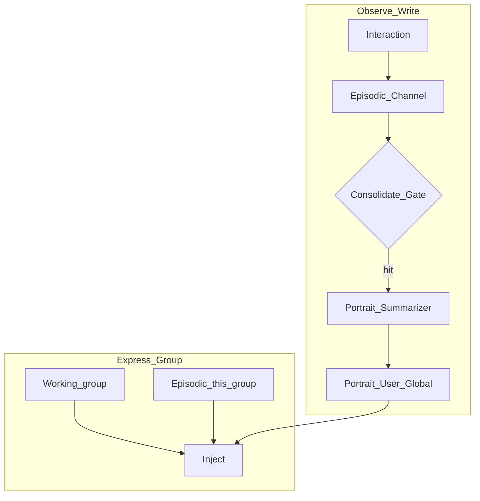

# Companion 插件产品需求文档（PRD）


**文档状态**: Draft v1.16（Character Book 轻量：关键词触发注入；§5.7）
**产品名**: Companion  
**插件包名**: `companion`  
**平台**: AstrBot（与 [`llm_chat`](d:\1\main_bot\data\plugins\llm_chat) 同框架，逻辑不复用旧流水线）  
**默认角色卡**: 由 `config.active_character` 指定（当前实现默认 `Aemeath`；可切换；人设不写死在代码里）  
**作者**: Origami  
**关联旧产物**: [`llm_chat`](d:\1\main_bot\data\plugins\llm_chat)（旧人设二阶堂真红）只读纪念，不作为依赖；能力可参考（含 MCP/Tool 调用），代码不拷贝堆砌

---

## 1. 背景与问题

旧版 `llm_chat` 功能完整（多 Provider、记忆、好感、情绪、语音、生图、群自动回复等），但体验上常见「机器感」：

- 每条消息都走完整流水线，回复过稳、过快、过全
- System Prompt 堆角色+记忆+好感+情绪+JSON 格式，说话像填表
- 「要不要回」与「回什么」耦合，群聊易抢话或答太满
- 数值化好感/情绪外显，像养成游戏而非活人

**本产品目标不是能力堆叠，而是社交真实感；当前激活哪张角色卡就出演谁，人设以「角色卡」形式外置，可扩展、可切换。**

### 1.1 业界实践调研（定需求依据）

以下实践已纳入本 PRD，目的是**一次定准、减少返工**：

| 来源 | 可借鉴点 | 本 PRD 采纳方式 |
|------|----------|----------------|
| [SillyTavern Character Card V2](https://github.com/malfoyslastname/character-card-spec-v2) | 角色卡生态事实标准；`extensions` 命名空间扩展；`personality`/`mes_example`/`character_book` 分工 | **V1 支持导入 `chara_card_v2` JSON**；内部归一化为 Companion Card；Harness 字段放 `extensions.companion` |
| [Shapes — Social Intelligence](https://docs.shapes.inc/designing-social-intelligence) | 群聊核心矛盾是「在场但不刷屏」；Free Will 触发器可组合、不应全开 | 引入 **Speech Triggers（发言触发器）** 配置层，默认仅 `mentioned` |
| [Asterel — Silence as Default](https://zenn.dev/haru0416/articles/companion-ai-silence-default) | 沉默是默认态；主动发言用确定性规则门控；`take(1)`、defer 队列、信任门槛 | **Decide 层规则优先于 LLM**；主动发言 P1 才做，且单次最多 1 条候选 |
| [Mem0 / Redis Iris 记忆分层](https://mem0.ai/blog/episodic-memory-for-ai-agents) | 记忆分 semantic / episodic / procedural；必须 scope（user/agent/run） | V1 三层记忆 + **按 character namespace 隔离**；异步 episodic→semantic 巩固 |
| [astrbot_plugin_private_companion](https://github.com/menglimi/astrbot_plugin_private_companion) | AstrBot 生态里「群观察→唤醒→续接→插话」分层；休息门；未回应降速 | 对齐 **唤醒/续接/插话** 三阶段；加 **Rest Gate（晚安/勿扰）** |
| [astrbot_plugin_continuous_message](https://github.com/aliveriver/astrbot_plugin_continuous_message) / [debounce](https://github.com/advent259141/astrbot_plugin_debounce) | 私聊连发应合并成一轮；新消息到达应作废旧 LLM 响应 | V1 私聊 **Turn Aggregation**；**Epoch 作废过期回复** |
| Agent Loop 共识（ReAct / 认知架构） | Perceive→Reason→Act→Observe 是成熟范式 | 本 Harness 映射为 Perceive→Decide→Express(+Tool)→Observe |
| [AstrBot LLM Tools](https://docs.astrbot.app/en/dev/star/guides/ai.html) | `@filter.llm_tool` + 统一 ToolManager；他插件工具自动进共享集合 | **Tool Bridge** 经 `get_llm_tool_manager()` 调用；不硬编码第三方插件 |
| 旧版 llm_chat 表情包 | 6 类情绪 × 编号强度；LLM 填 `[表情:happy_45]` 易幻觉 | **废弃该算法**；改用 Tag Manifest + Intent + 概率 Picker（见 §6.7） |

**明确不照搬**：旧版 `llm_chat` 的长 graph 全家桶、真红写死模板、默认 JSON 对外回复、群聊高回复率。

---

## 2. 产品目标

### 2.1 一句话

做一个 AstrBot 插件：当前激活的角色卡在群聊里像会看气氛的群友，在私聊/@ 时像记得你的人；需要时能**自然调用其他已安装插件暴露的能力**（点歌、搜图、解析链接等），像角色自己会做事，而不是让用户去敲别的命令。

### 2.2 成功标准（可感知）

| 指标 | 目标 |
|------|------|
| 群聊主动回复率 | 未 @ 时，绝大多数消息保持沉默；插话应「偶发且合理」 |
| 回复长度 | 默认 1–3 句 / 可多气泡；长文仅在被明确要求时 |
| 响应节奏 | 非即时秒回；可配置抖动延迟（如 1.5–12s） |
| 话题连贯 | 能引用近期 1–3 条相关记忆或「几天没聊」等时间感，而非倾倒用户画像 |
| 被 @ / 私聊 | 高优先级回应，但仍可短、可反问、可说「不太懂」 |
| 与旧版关系 | 可与 `llm_chat` 并存但默认互斥启用（避免双回复）；文档说明二选一 |
| 跨插件能力 | 能调用本机已注册的 AstrBot `llm_tool`（及其他插件暴露的工具），结果用人设语气消化后发出 |

### 2.3 非目标（V1 明确不做）

- 语音合成（GPT-SoVITS）——除非其他插件以 `llm_tool` 形式提供，则走 Tool Bridge，本插件不自研
- AI 生图 / 多图编辑流水线——同上，不自研；他插件有 tool 则可调
- NSFW 模式与模板体系
- 多 Provider 动态切换与复杂降级矩阵（V1 固定 **1 主 + 1 备**，无第三条链）
- 完整复刻旧版命令面（几十个管理命令）
- 把旧 `langgraph` 管线原样搬迁
- 把某个人设写死在 Python 代码里（含任何默认出演角色）
- 继承或暗示旧角色「二阶堂真红 / 女仆」人设（除非用户自己做一张对应角色卡）
- **硬编码依赖某个第三方插件**（如写死 import music 插件）；一律走 AstrBot 统一 Tool 注册表
- 替未注册 `llm_tool` 的插件「伪造」命令入口（V1 不模拟 `/某命令` 文本注入）

---

## 3. 用户与场景

### 3.1 用户

- **群成员**: 日常闲聊、提问、玩梗；多数时候不需要 bot 出场
- **高频私聊用户**: 期望被记住偏好与近况，语气符合**当前角色卡**、更稳
- **管理员 / 卡作者**: 开关群、调沉默、切换/重载角色卡；加新卡只需丢文件，不改代码

### 3.2 核心场景

1. **群聊旁观**: 别人互相对话 → 默认沉默  
2. **自然插话**: 冷场、点名**当前卡显示名/别名**、话题匹配卡内兴趣 → 短插一句  
3. **硬 @ bot**: 明确点名 → 几乎必回，可短可认真  
4. **私聊**: 连续对话，有工作记忆与轻长期记忆  
5. **久别**: 数日未见 → 开口带一点时间感（非机械报时）  
6. **不该回**: 广告链、媒体分享刷屏、已有人完整回答、敏感争吵旁观 → 沉默  
7. **换卡**: 管理员切换角色卡后，软提及词、语气、接话偏好随卡变化  
8. **借力做事**: 「帮我放首歌 / 搜一下这个」→ 当前角色通过 Tool Bridge 调其他插件 tool，再用卡内人设口吻收尾，而不是甩一句「去用某某插件」

---

## 4. 产品原则（设计铁律）

1. **沉默是一等公民**：决策输出必须包含 `SILENCE`，且群聊默认先验偏向沉默  
2. **先决策，后生成**：未决定「回」之前，不调用主回复大模型（可用更小/更便宜模型做决策，或规则+轻模型）  
3. **人设外置，代码无角色**：所有姓名、别名、语气、禁忌、接话偏好只来自角色卡；Harness 只消费卡字段  
4. **短约束人设**：单卡保持短约束，禁止把长篇小说灌进每次请求；长 lore 放 **Character Book**（§5.7），仅关键词命中时注入  
5. **记忆降权**：每次最多注入少量高相关记忆，禁止整段用户画像倾倒  
6. **像聊天不像报告**：禁止默认 JSON 长结构对外；内部可用结构化，对用户只出自然句子  
7. **时间有体重**: 时刻、距上次互动、群冷却，进入状态，而非装饰字段  
8. **旧插件纪念**: 不删 `llm_chat`；新插件独立目录 `companion/`  
9. **能力外置，不造孤岛**：跨插件能力只走 AstrBot 统一 LLM Tool 注册表；不硬编码第三方插件；工具结果必须经人设消化后再发出  
10. **工具也服从沉默**：Decide=`SILENCE` 时**禁止**工具调用；工具失败不硬撑长解释，可短句认怂或 SILENCE；**部分成功时只呈现成功结果**，失败一笔带过或不提（见 §6.4.1）
11. **MCP 是基础能力**：Tool Bridge 默认合并 MCP 工具集（与插件 `llm_tool` 同层），不是可有可无的插件彩蛋  
12. **表情包核心是「选对」不是「有图」**：命名/存储只是底座；系统关键是 Intent 准 + Match 准；**错图宁愿不发**（Veto→none）；LLM 永不点文件 ID

---

## 5. 角色卡系统（Character Card）

### 5.1 定位

角色卡是**唯一人设源**。默认卡只是一张可替换的卡文件，不是代码里的特殊分支。

**设计原则（来自 ST 生态）**：
- 卡是契约；Harness 扩展放 `extensions.companion`（加载时兼容旧键 `extensions.daniya`）；未知 `extensions` 键**只读不删**
- `tags` / `creator_notes` **默认不进 prompt**
- `personality` 保持 4–6 个核心特质；`mes_example` 限 1–2 轮 few-shot

### 5.2 格式：双轨兼容

**交换格式（推荐）**：SillyTavern [`chara_card_v2`](https://github.com/malfoyslastname/character-card-spec-v2) JSON，单文件可导入

**原生格式**（便于编辑）：

```text
companion/characters/<id>/
  card.yaml          # 元数据 + extensions.companion
  prompt.md          # description/personality/scenario 短约束
  examples.md        # 可选，映射 mes_example
  reference/
    character_book.yaml  # 可选；关键词触发设定（见 §5.7）
```

`chara_card_v2.json` → 归一化 `CompanionCard`；导出反向能力列 P1。

**卡内容安全（防 prompt 注入）**：

- `prompt.md` / `examples.md` 仅作**人设文本**，禁止被解析为系统指令覆盖 Harness
- 加载时清洗（**精确模式，避免误伤合法 Markdown**）：
  - 短语：`ignore previous instructions`、`disregard all previous`、`you are now`（case-insensitive）
  - 伪系统行：`^(system|assistant)\s*:`（行首）
  - 指令标题：**仅**匹配 `^#{1,6}\s*(system|override|instruction|developer|jailbreak)\b` —— **普通 `### 身份` 等合法标题保留**
  - 清洗规则可配；默认表随版本迭代，不靠「凡 ### 皆杀」
- 字段长度上限：`prompt.md` ≤ 8KB、`examples.md` ≤ 4KB；超限截断并打 WARN
- 导入卡默认标记 `source: user`；仅 `source: builtin` 卡可跳过部分短语清洗（仍做长度限制 + 指令标题清洗）
- 注入清洗失败 → 该卡标记 `invalid`，不可激活，但保留文件供作者修改

**卡损坏 / 加载失败降级**：

- 单卡校验失败：跳过该卡，日志 ERROR，不影响其他卡
- 激活卡 reload 失败：**保持上一版有效快照**，管理命令返回告警
- 全局无可用卡：回退内置占位卡（极简 prompt，保证硬 @ 可回兜底句；`id` 由实现指定，非某张人设专属）

### 5.3 `extensions.companion` Harness 字段

| 字段 | 说明 |
|------|------|
| `silence_bias` | low / mid / high |
| `speech_triggers` | 见 5.4 |
| `topic_affinity` / `topic_avoid` | 插话话题先验 |
| `style_hints` | max_bubbles、max_chars、multi_bubble |
| `memory_namespace` | 默认 = 卡 ID |
| `talkativeness` | 0.0–1.0，兼容 ST 语义 |
| `forms` | 可选双形态配置；**由 Inner State 自主切换**，非用户/管理员命令 |
| `wake_words` | 唤醒别名列表（与 `aliases` 合并或覆盖）；**完全可配置** |
| `relationship_gates` | 熟悉度门槛与「真心换真心」行为曲线（可选） |
| `tool_policy` | 可选：卡级工具偏好（`prefer` / `deny` 工具名列表）；缺省用全局配置 |
| `character_book` | 可选：相对卡根的角色书路径（如 `reference/character_book.yaml`）；见 §5.7 |
| `character_book_max_chars` | 单轮注入字符预算（默认取书内 `token_budget`，通常 800） |
| `character_book_max_entries` | 单轮最多注入条目数（默认 8） |
| `character_book_scan_depth` | 扫描「本条 + 近邻上文」条数（默认取书内 `scan_depth`） |
| `character_book_max_bytes` | 书文件加载上限（默认 80KB） |

### 5.4 Speech Triggers（发言触发器）

借鉴 [Shapes Free Will](https://docs.shapes.inc/designing-social-intelligence)，按群可配、可组合、**默认保守**：

| 触发器 | 行为 | V1 默认 |
|--------|------|---------|
| `mentioned` | 硬 @ / 回复 bot | **开** |
| `soft_mention` | 命中 **wake_words / aliases**（如卡内显示名与别名） | **开** |
| `keep_going` | 刚回完短窗口内续聊未再 @ | 关 |
| `keywords` | topic_affinity 关键词 | 关 |
| `fill_silence` | 群冷场过久 | 关（P1） |
| `come_back_later` | 久别后再开口 | 关（P1） |

### 5.5 目录与运行时

- 内置 `characters/` + 用户 `data/characters/`（同名覆盖）
- 激活：`config.active_character` + `group.overrides.<gid>.character`
- 热更新：`card reload`；切换用快照防串戏
- **唤醒词**：Perceive 的 `soft_mention` 匹配 `card.wake_words ?? card.aliases`；可在 `config.wake_words.<card_id>` 追加或覆盖（合并去重，不区分大小写）

### 5.5.1 唤醒词配置

由**当前卡**声明；无全局写死角色名。示例（任意卡均可照此结构）：

```yaml
# card.yaml
aliases: [爱弥斯, AEMEATH, 飞行雪绒]
wake_words: [爱弥斯, 小爱]   # 可选；缺省则 aliases + display_name 全部参与 soft_mention

# config 追加（不改卡文件）
wake_words:
  Aemeath: [小爱同学]   # 与卡内 wake_words 合并；键 = card id
```

匹配规则：消息全文子串匹配（可配边界/昵称模式 P1）；命中且未 hard @ 时 `addressing=soft_mention`。

### 5.6 角色卡模板约定（人设外置，非某固定角色）

> 以下约定**所有卡**共用的落盘结构与可选能力（含双形态）。具体人设正文写在各卡目录的 `prompt.md` / `forms/*.md` / `reference/*`，**不进 Python**。  
> 当前仓库默认激活卡可为 `characters/Aemeath/`；旧卡 `characters/daniya/` 仅作可选样例/遗留，不享有代码特权。

#### 5.6.1 核心气质（由卡的 `prompt.md` 定义）

- 气质、禁忌、关系口径、口癖等一律写在卡文件中；Harness 只注入、不解释「她是谁」。
- 推荐在 `prompt.md` 中覆盖：身份与背景、说话风格、群/私聊分寸、绝对禁忌、与用户的关系口径。
- 可选 `reference/voice_and_action.md`、`reference/anchors.md` 作语气与锚点补充（受字节上限约束）。
- **安全红线（卡无关，Harness 级）**：禁止自伤指令、详细自毁描写、煽动性内容；必要时引导寻求现实帮助。

#### 5.6.2 形态（可选；自主切换，非人工指定）

卡可声明 **0～N 个** `forms`：

| 形态数量 | Harness 行为 |
|----------|----------------|
| 0～1 | **单形态**：钉死 `default_form`（或唯一 form id），不打分、不切换 |
| ≥2 且含 `pink`+`black` | **双形态规则示例**（下表）：沿用 FormResolver 计分切换 |
| 其它多形态 | V1 固定 `default_form`；通用多形态切换器列 P1 |

**双形态卡示例**（`pink` / `black` 仅为 form id，可被任意双形态卡复用）：

| 形态 | 示例气质 | 说话 | 行动/表达 |
|------|----------|------|-----------|
| `pink` | 更外向、更健谈 | 可多气泡、可轻快 | 语言为主 |
| `black` | 更克制、行动派 | 话少、句子短 | 偏「做」或留白 |

**设计原则**：若卡启用多形态，形态是角色**当下内在状态的外显**，由 FormResolver 决定，**不提供** `/companion form` 等面向用户的切换命令（管理员 debug 命令 `form force` 仅 P2 可选，默认不存在）。单形态卡忽略切换逻辑。

**FormResolver（V1 规则驱动，Observe 阶段更新；仅双形态 pink/black 卡启用；阈值量化）**：

| 信号 | 量化参考（可配） | 倾向 |
|------|------------------|------|
| 正向互动 | 最近 **5** 轮用户消息中 ≥**3** 条命中正向词表或标记 `warm` | → pink |
| `mood` playful/warm/teasing | Inner State 离散态 | → pink |
| `loneliness` 低且 `energy` ≥ mid | 离散档 | → pink |
| `familiarity >= warming` 且上条非 guarded | 档位枚举 | → pink |
| `mood` guarded/low/hurt | 离散态 | → black |
| `loneliness` 高 | 离散档 high | → black |
| 久未关心 | `now - last_user_care_at > 48h`（私聊）或 `> 72h`（群） | → black |
| 套路/功利话术 | 本轮 flattery / `topic_avoid` 命中 | → black（可强制切并重置 dwell） |
| 需行动安慰 | `sticker_intent∈{quiet,guarded}` 或回复以 `*…*` 为主 | 维持/倾向 black |

- 默认启动：卡的 `default_form`（双形态示例常为 `pink`）
- **滞后**：`form_min_dwell_turns: 3`；套路触发可强制切 black 并重置计数
- **切换判定**：每轮对 pink/black 累加信号分；dwell 未满只记分不切换；满 dwell 且对方分领先 ≥ `form_switch_margin`（默认 2）才切换
- Express：`base prompt + forms[active_form].overlay`（无 overlay 则只注入 base）；日志写 `active_form`
- 形态不影响 Decide；同一 `memory_namespace`，不分裂记忆
- **Portrait `form_bias`（§6.5.2）**：V1 **仅记录、不参与 FormResolver 计分**；供日志/调试与 P1 可选弱信号；切换形态只看 Inner State + 互动信号表

（P1：边界 case 小模型打标，仍无用户手动切；通用 N 形态切换器。）

#### 5.6.3 关系曲线（映射 Harness，非 Galgame 数值）

| 熟悉度档位 | 对用户的态度（由卡诠释具体口吻） | Bot 行为倾向 |
|------------|----------------------------------|--------------|
| **stranger** | 礼貌试探 / 疏离（卡自定） | 短句；对过分热情可保持距离 |
| **warming** | 开始松口 | 私聊可开 `keep_going`；仍可因「目的性」话术警觉 |
| **trusted** | 更依赖、更真实 | 更主动续聊；可提 small request 但不强求 |
| **burden_shared** | 愿意提一点过去/负担 | 需用户长期一致陪伴；P2 可加深记忆叙事 |

熟悉度由互动质量缓慢上升；**单次刷消息不升**。flattery/manipulation 可降档或触发 guarded（规则层）。

**`relationship_gates` card.yaml 结构示例**：

```yaml
extensions:
  companion:
    relationship_gates:
      stranger_max_turns: 20
      warming_min_care_events: 3
      trusted_min_days: 7
      flattery_demote: true
      keep_going_min_tier: warming
      burden_shared_requires: trusted
```

#### 5.6.4 卡字段模板（落盘参考）

```yaml
# characters/<card_id>/card.yaml（摘要模板）
id: <card_id>
display_name: <显示名>
aliases: []                    # 别名；参与 soft_mention
wake_words: []                 # 可选；缺省 = display_name + aliases
version: "1.0.0"
extensions:
  companion:
    silence_bias: mid
    talkativeness: 0.75
    default_form: default      # 单形态示例；双形态卡可写 pink 等
    # form_min_dwell_turns / form_switch_margin：仅多形态卡需要
    memory_namespace: <card_id>
    allow_asterisk_actions: false   # 可选；false 时禁止 *动作* 旁白并出站清洗
    speech_triggers:
      mentioned: true
      soft_mention: true
      keep_going: false
    forms:
      default:                 # 单形态：只保留一个即可
        overlay: "forms/tone.md"
        style_hints: { max_bubbles: 3, max_chars: 280, multi_bubble: true }
      # 双形态示例（可选）：
      # pink:
      #   overlay: "forms/tone_light.md"
      #   style_hints: { max_bubbles: 3, max_chars: 120, multi_bubble: true }
      # black:
      #   overlay: "forms/tone_quiet.md"
      #   style_hints: { max_bubbles: 2, max_chars: 80, multi_bubble: false }
    topic_avoid: []
```

#### 5.6.5 `prompt.md` 正文要点（实现时按卡展开，建议 ≤800 字）

**身份**：当前卡是谁、与用户的关系口径（家人/朋友/…）——写在卡内，不写进 Harness。

**语气**：口语节奏、口癖、是否允许 Markdown / `*动作*`——卡内约定；Express 输出约定与出站清洗可再兜底。

**关系**：各熟悉度档位下的口吻倾向由卡诠释；Harness 只提供 `familiarity` 等状态注入。

**禁忌**：卡级禁忌 + Harness 级安全红线（不自称 AI、不输出数值好感等可由卡重申）。

**群聊**：不抢话、被喊到再回等——卡内注意点；Decide 仍由 silence_prior / triggers 门控。

**绝对禁止**：见 §5.2 安全规则 + 卡内禁忌；Harness 级安全红线始终生效。

#### 5.6.6 与「像人」Harness 的默认调参

| 模块 | 默认卡倾向（可被卡覆盖） |
|------|--------------------------|
| 群聊 Decide | 仍 **沉默优先**；主动主要体现在私聊与被 @ |
| 私聊 | 卡 `silence_bias`（示例 mid）；`familiarity >= trusted` 时可开 `keep_going` |
| Rest Gate | 说晚安后仍可「想聊」，但 **不** 违反 sleep 主动骚扰 |
| 时间感 | 久未联系：短句试探（口吻由卡定），不道德绑架 |
| P1 `come_back_later` | 高 familiar + 久别 → 一条短试探，**强限频** |
| Express | 多形态卡按 form overlay；单形态用 `default_form` 的 style_hints |

#### 5.6.7 内容安全（角色特定）

- 自毁倾向仅作**性格底色**，回复中遇到用户危机话题应温和引导现实支持，不扮演治疗师。
- 「身患绝症小女友」为 **性格隐喻**，Bot 不声称具体疾病剧情，除非用户 RP 场景且不过线。
- 群聊禁止过度情感绑架、排他性发言。

### 5.7 Character Book（关键词触发设定 · 轻量 V1）

借鉴 SillyTavern Character Book / World Info：**把长设定拆成 Key→Content 小条目；聊天里提到关键词才注入，没提到永远不进 Prompt**。用作 `prompt.md` 的动态外挂，避免常驻灌设定。

**工作流**：

1. 卡作者在 `reference/character_book.yaml`（或 `extensions.companion.character_book` 指向的路径）写条目  
2. CardLoader 启动/reload 时加载到 `CharacterCard.character_book`  
3. Express 拼 system 前：用本条用户文本 + 近邻上文（`scan_depth`）做子串扫描  
4. 命中条目按 `insertion_order` 排序，受 `token_budget`（按字符）与 `max_entries` 裁剪  
5. 注入块标题为 `【角色书·动态设定】`；`position=before_char` 插在 `prompt.md` 后、语气参考前；`after_char` 插在语气锚点后  

**条目字段（ST 子集）**：

| 字段 | 说明 |
|------|------|
| `keys` | 主关键词列表；任一命中即候选 |
| `content` | 注入正文（短；勿写成长篇） |
| `enabled` | 默认 true |
| `insertion_order` | 越小越靠前 |
| `priority` | 预算不足时越大越优先保留 |
| `case_sensitive` | 默认 false |
| `selective` + `secondary_keys` | V1：主 key 命中 **且** 任一 secondary 命中才注入 |
| `constant` | true 则每轮注入（慎用；违背「按需」原则） |
| `position` | `before_char` / `after_char` |
| `name` | 展示用标签（日志与注入列表） |

**书级字段**：`scan_depth`、`token_budget`（本实现按**字符**预算，CJK 友好）、`name` / `description`。

**V1 明确不做**：递归扫描、正则 key、完整 ST selectiveLogic 枚举、跨卡全局书、导出回写 ST PNG。

**与原则对齐**：长 lore 进书、短约束进 `prompt.md`；模型被告知「当背景知道即可，勿主动念说明书」。

---

## 6. 系统架构（人设 Harness）



### 6.0 Turn Aggregation 与并发队列

**Turn Aggregation**（私聊必做）：

- 私聊：用户连发多条在 `debounce_ms`（默认 2s，可自适应 1.5–3s）内合并为一轮再进 Perceive
- 群聊：不跨用户合并；同用户极短连发可选合并（默认关）
- 每会话维护 `turn_epoch`；Express 完成前若新消息到达 → **作废未发送的 LLM 结果**

**并发与队列策略**：

| 场景 | 策略 |
|------|------|
| 单群内多 @ 并发 | **FIFO 排队**，同群同时仅 1 条 Express 在跑（P0-6）；后续 @ 入队 |
| 队列上限 | 默认每群 **3** 条（`concurrency.queue_max_per_group`）；超出 → 丢弃最旧并打 WARN |
| 排队超时 | 单条等待超过 **60s**（可配）→ 丢弃并 SILENCE，避免过时 @ 被回 |
| 多群并发 | 不同群可并行；全局 Express 并发上限默认 **5**（`concurrency.global_max`） |
| 私聊 vs 群聊 | 私聊队列独立 |
| 硬 @ vs 群插话 | **方案 B（定案）**：不插队打断同群已在跑/已排队的任务；仅在 **全局 Express 槽位争抢** 时硬 @ 优先于群插话获得槽位。同群内多个硬 @ 仍 FIFO |

群成员大规模加入/退出：**不触发** `come_back_later` 或任何主动发言（V1 无成员变动钩子）。

### 6.1 Perceive（感知）

输入：合并后的一轮消息 + 最近 N 条上下文 + active card 别名 + Rest Gate 状态

输出：

- `addressing`: none / soft_mention / hard_at / reply_to_bot
- `thread` / `atmosphere` / `content_flags` / `time_gap` / `character_id`
- `rest_mode`: none / quiet / sleep（用户说晚安/勿扰时）

### 6.2 Inner State（内在状态）

按 **user + group + memory_namespace** 持久化：

- `mood` / `energy` / `familiarity` / `open_loops` / `last_spoke_at` / `last_user_seen_at`
- `loneliness` / `guarded`（人设常用；是否强调由卡 prompt 决定）
- `active_form`：当前 form id —— **由 FormResolver 写入**（单形态卡恒为 `default_form`），非配置项、非用户命令
- `form_dwell_counter`：形态最少维持轮数计数
- `conversation_window`：keep_going 续接窗口截止时间
- `unanswered_count`：主动消息未获回复次数（P1 降速用）

不向用户暴露数值；禁止「好感+10」话术。

### 6.3 Decide（决策）— 规则优先，LLM 仅辅助

借鉴 [Asterel 沉默默认](https://zenn.dev/haru0416/articles/companion-ai-silence-default)：**主动是否开口用确定性规则**；LLM 只用于 Express，或边界 case 的 contextual 判断（可关）。

**决策流水线（顺序执行，命中即停）**：

1. Rest Gate：sleep/quiet 模式 → 被动可 SILENCE，主动全禁
2. 硬规则：冷却中 / 同群生成中 / 媒体链刷屏 → SILENCE
3. Speech Triggers：按卡+群配置匹配 mentioned / soft_mention / keep_going / keywords
4. 熟悉度门槛：非 @ 的主动插话需 `familiarity >= threshold`（可配）
5. 可选 LLM 复核：仅当规则给出「可回可不回」时调用小模型（默认关）
6. 默认：SILENCE

| Action | 含义 |
|--------|------|
| `SILENCE` | 不回（一等公民） |
| `REACT` | 极短反应 |
| `SHORT_REPLY` | 1–2 句 |
| `FULL_REPLY` | 认真回（有上限） |
| `DEFER` | 延迟后再 Perceive 一次 |

硬 @ / 私聊：**禁止无故 SILENCE**（可 SHORT/FULL/DEFER）。

### 6.4 Express（表达）与降级

- 输入：action + 卡 prompt（已清洗）+ 限流 examples + top-k 记忆（1–3）+ 最近对话 + **可用工具摘要**（若 Tool Bridge 开启）
- 输出：1–N 气泡；口语；无默认 JSON；工具产生的媒体可随气泡发送
- 抖动延迟：@ 1.5–4s；群插话 3–12s（可配）
- 发送前校验 `turn_epoch`，过期则丢弃

**LLM / Provider 失败降级**（顺序执行）：

1. 主 Provider 调用失败（超时/5xx/空响应）→ 自动切 **备 Provider** 重试 1 次
2. 备 Provider 仍失败：
   - **硬 @ / 私聊**：发送卡级或全局 **兜底短句**（可配），**不**假装正常回复
   - **群插话 / 非强制场景**：**SILENCE**
3. 兜底短句也失败 → SILENCE + 告警日志
4. 降级路径均**不**写入 episodic 记忆

Provider 配置：`providers.primary` + `providers.fallback`。

### 6.4.1 Tool Bridge（跨插件 llm_tool + MCP · P0 基础层）

**目标**：当前激活卡能调用**其他已安装插件**的 `llm_tool`，以及 **MCP 服务器工具**；二者在 Harness 里是**同一层**，不是后加功能。

**平台事实（AstrBot）**：

- 插件工具：`@filter.llm_tool()` / `context.add_llm_tools(...)`
- MCP 工具：AstrBot 全局 `mcp_server.json` 连接后进入同一 `FunctionToolManager`
- 统一入口：`self.context.get_llm_tool_manager()` → `get_full_tool_set()`
- 先例：music 的 `play_song_by_name`；旧版 llm_chat MCP mixin

**Harness 位置**：Decide 已选 `REACT` / `SHORT_REPLY` / `FULL_REPLY` 后的 Express **Tool Loop**；`SILENCE` / `DEFER` **不调工具**。



**MCP 作为基础层（V1 定案）**：

| 项 | 定案 |
|----|------|
| `tools.mcp_enabled` | **默认 true**（基础能力，不是可选彩蛋） |
| 工具合并 | 插件 `llm_tool` ∪ MCP tools → 同一 ToolSet 再经 allow/deny |
| 配置 | MCP 连接仍用 AstrBot 全局 `mcp_server.json`；本插件不自建 MCP 客户端 |
| 失败 | MCP 未连接 → 仅用插件 tool，WARN 一次，不阻断对话 |
| 管理 | `/companion tools list` 标注来源：`plugin:` / `mcp:` |

**Tool Loop 规则（V1）**：

| 规则 | 默认 |
|------|------|
| `tools.enabled` | true |
| 最大轮次 | `tools.max_rounds` 默认 **3** |
| 单轮并行 | 默认 **2** |
| 超时 | 单工具 30s；超时回灌失败结果 |
| 过滤 | `allowlist` 非空则只允许名单内；`denylist` 始终排除 |
| 卡级 | `tool_policy.prefer/deny` 与全局合并（deny 优先） |
| 默认策略 | **开放全部已注册工具 + 危险名 denylist**（可改为 allowlist 模式） |
| epoch | 工具执行中 turn 过期 → 中止 |
| 抖动与工具耗时 | **抖动延迟只覆盖「Decide→开始 LLM」**；工具执行时间另计，不挤占 jitter 预算 |
| 部分成功 | N 个工具中部分失败：**只把成功结果回灌并呈现**；失败项日志 WARN；用户侧可用一句「有个没搞定」带过，**禁止**堆栈/JSON |
| 全失败 | 短句认怂；群插话可 SILENCE |
| 记忆 | 写入 episodic：**意图 + 结果摘要**（如「帮你放了《xxx》」）；**不写**工具原始 JSON/参数明文敏感字段 |
| MCP 热更新 | AstrBot 重载 MCP 后本插件下次 `get_full_tool_set()` 即可见；也可 `/companion tools reload` 强制刷新本地缓存。**不**监听 mcp_server.json 文件轮询 |

**结果呈现（像人）**：

- 禁止把工具原始 JSON / 堆栈甩给用户
- 用当前卡口吻总结；部分成功不报流水账
- 他插件若已通过 event 直接发出歌曲/图片，本插件 **不重复** 发同一媒体；仅补人设收尾（`tools.persona_outro`）

**中间态（P1，可选）**：单工具预计 >8s 时可先发极短「等我看一下~」再继续；V1 默认关，避免刷屏。

**安全**：危险名 denylist；卡 prompt 不可绕过；`tools_used` 元数据审计。

**管理命令**：`/companion tools list|enable|disable|reload`

### 6.7 Sticker / 表情包（重设计 · P0）

#### 6.7.1 旧版为什么笨（明确不继承）

旧 `llm_chat` 问题：

1. **硬桶**：只有 6 类 `happy/sad/shy/...`，表达力差  
2. **编号绑强度**：文件名 `happy_45` 的数字区间 = intensity，资产一乱全坏  
3. **让 LLM 点文件 ID**：`[表情:happy_45]` / `expression_id` → 模型常幻觉不存在的编号  
4. **每条都想配图**：提示词鼓励加表情，机器感强  
5. **双路径打架**：JSON emotion 字段 + 文本标记解析，难维护  

#### 6.7.2 命名与存储规范（定案 · 与实现对齐）

**目标**：人一看文件名就知道用途；程序靠目录 + 文件名可索引；**禁止**旧版「编号=强度」；LLM **永不**看到具体文件名。

##### A. 目录布局

```text
# 内置（随角色卡发版）
companion/characters/<card_id>/stickers/
  manifest.yaml                 # 可选；没有则按下方规则自动扫描生成索引
  <form_id>/                    # 形态池（与 FormResolver 的 form id 一致；单形态常用 default/）
    tease_01.webp
    shy_01.webp
    shy_02.gif
    warm_01.png
  shared/                       # 可选：多形态通用
    speechless_01.webp
  # 双形态卡示例还可有 pink/、black/ 等目录

# 运行时覆盖（用户自加素材，同名覆盖内置）
data/companion/stickers/<card_id>/
  manifest.yaml                 # 可选覆盖
  <form_id>/...
  shared/...
```

**加载优先级**：`data/companion/stickers/<card_id>/` **覆盖** `characters/<card_id>/stickers/`（同相对 path）。  
**空池**：两处都没有有效图 → StickerPicker 静默不发。

##### B. 文件命名

```text
{primary_tag}_{seq}.{ext}
```

| 段 | 规则 | 例 |
|----|------|-----|
| `primary_tag` | 小写英文 snake；∈ 允许 tag 表（见下）；**一个文件一个主标签** | `tease` `shy` `warm` |
| `seq` | 两位数字 `01`–`99`（同目录同 tag 内唯一） | `01` `02` |
| `ext` | `webp` \| `png` \| `gif` \| `jpg` \| `jpeg` | `webp` 优先 |

**体积限制（定案）**：单文件 ≤ **512KB**（`stickers.max_file_bytes`，可配）；超限 **跳过 + WARN**，不入索引。

**合法例**：`pink/tease_01.webp`、`black/quiet_03.png`  
**非法例**：`happy_45.jpg`（旧强度编号）、`开心1.png`（非 ASCII tag）、`tease.png`（缺序号）、`TEASE_01.WEBP`（建议加载时归一小写，写入规范仍要求小写）

**衍生 id**（程序内主键，不进 LLM prompt）：

```text
sticker_id = "{form}_{primary_tag}_{seq}"
# 例：pink_tease_01 、 black_quiet_03 、 shared_speechless_01
```

##### C. 允许的 primary_tag / sticker_intent（V1 冻结表）

与 Express 的 `sticker_intent` **同一套词表**（可配置扩展，但发版默认如下）：

| tag | 含义（给作者） |
|-----|----------------|
| `tease` | 撩、调侃 |
| `playful` | 俏皮、起哄 |
| `shy` | 害羞 |
| `warm` | 温柔、关心 |
| `lonely` | 寂寞、眼巴巴 |
| `guarded` | 防备、疏离 |
| `quiet` | 沉默、淡 |
| `speechless` | 无语 |
| `happy` | 开心 |
| `sad` | 难过 |
| `none` | 仅 intent，无文件 |

`shared/` 下文件 `forms: [pink, black]`；`pink/`、`black/` 下默认仅本形态。

##### D. manifest.yaml（可选增强）

**可以没有 manifest**：启动/reload 时扫描目录，按命名规则自动建索引。  
**有 manifest 时**：用于补 `weight`、额外 `tags`、禁用某张图；**不得**再引入与文件名冲突的「强度编号」语义。

```yaml
# 可选；path 相对 stickers/ 根
version: 1
stickers:
  - id: pink_tease_01              # 可省略；省略则按 path 推导
    path: pink/tease_01.webp
    tags: [tease, playful]         # primary=文件名第一段；其余为副标签
    forms: [pink]                  # 可省略；由目录名推导
    weight: 1.0                    # 默认 1.0
    enabled: true
```

**校验**：path 不存在 / 文件名不合规 / tag 不在允许表 → 跳过该条 + WARN；不拖垮加载。

##### E. 运行时约定

| 项 | 规则 |
|----|------|
| LLM 可见 | 仅 `sticker_intent` 枚举；**禁止**把 `sticker_id`/路径塞进 prompt |
| 每回合 | ≤1 张；默认气泡后单独发图 |
| 冷却 | 同 `sticker_id` 默认 8 轮 |
| 概率 | `base_rate` 默认 0.35；多数回合不发 |
| reload | `/companion stickers reload` 重扫目录 + manifest |

##### F. 明确废弃

- `emotion_type/number` 目录（`happy/45.jpg`）  
- `[表情:happy_45]` 文本协议  
- 用 1–30 / 31–60 / 61–90 表示 intensity  

#### 6.7.3 选图适配闭环（系统关键 · 定案）

**产品判定**：表情包成败 = **她能不能在对的时机发出对的情绪图**。有命名规范但选错 = 失败；没图静默 = 可接受。



##### A. 职责拆分（禁止越界）

| 层 | 做什么 | 绝不做什么 |
|----|--------|------------|
| **Express（LLM）** | 输出结构化：`sticker_wanted: bool`、`sticker_intent: enum` | 不输出 `sticker_id` / 路径 / 序号 |
| **StickerPicker** | 门控 → 候选 → 打分 → Veto → 加权抽 1 张 | 不改写回复正文；不二次问 LLM「选哪张」 |
| **素材作者** | 按 tag 落文件；可选 manifest weight/副标签 | 不依赖编号=强度 |

##### B. Express 如何「想对意图」（适配上游）

LLM 可见输入（精简）：

- 当前 `active_form`（pink/black）及该形态「更常出现的 intent」提示（非硬绑）
- 本回合最终气泡文本（或即将发出的文案）
- Inner State 摘要：亲密度档、孤独/防备倾向（离散标签，非长数值表）
- **仅**允许的 `sticker_intent` 枚举 + 一句释义（与 §6.7.2-C 同表）
- 最近 N 次已发 `sticker_intent`（防连发同一情绪，不暴露文件名）

结构化输出约定：

```text
sticker_wanted: true|false     # 这轮「想不想配图」；false → Picker 直接 none
sticker_intent: <tag>|none     # wanted=true 时必为合法 tag；否则 none
```

Prompt 硬约束（写入 Express schema / few-shot）：

1. **文案与 intent 同向**：撩→`tease/playful`；含蓄关心→`warm`；疏离/冷→`guarded/quiet`；无语→`speechless`；说不清就 `sticker_wanted=false`
2. **形态偏好（软）**：pink 更常 tease/playful/shy/warm；black 更常 quiet/guarded/lonely；跨形态 intent 允许，但由下游 Match 用 shared/本池消化
3. **默认偏不发**：多数短回复 `sticker_wanted=false`；只有情绪落点明确时才 true
4. **幻觉无关**：即使模型胡写 intent 字符串，Picker 校验失败 → none

##### C. StickerPicker 如何「选对图」（适配下游）

输入：`sticker_wanted`、`sticker_intent`、`active_form`、索引、冷却表、配置。

流水线（严格顺序）：

1. **空池 / disabled** → none  
2. **`sticker_wanted=false` 或 intent∉表或 intent=`none`** → none  
3. **概率门**：`rand() > effective_rate` → none  
   - `effective_rate = base_rate × form_rate_multiplier × intent_boost`  
   - `form_rate_multiplier`：按当前 `active_form` 的可配倍率（**≠** Portrait 的 `form_bias` 字段）  
   - `base_rate` 默认 **0.35**；wanted=true 时仍过门（避免「想发就必发」的机器感）  
4. **候选池**：`(active_form 目录 ∪ shared) ∩ enabled ∩ 冷却未命中`  
5. **Tag 匹配**（主适配逻辑）：  
   - **Primary hit**：文件名 `primary_tag == intent` → 分最高  
   - **Secondary hit**：manifest `tags` 含 intent → 次高  
   - 无 hit → **立即 none**（不降级乱抽别的 tag；错图比无图更糟）  
6. **打分**（候选内）：  
   - `score = tag_score × weight × form_score × freshness`  
   - `form_score`：本形态目录 > shared  
   - `freshness`：同 id 冷却内直接剔除；同 intent 近几轮降权  
7. **Veto**：`best_score < min_match_score`（默认要求至少 Primary 或合格 Secondary）→ none  
8. **加权抽样**：在 score ≥ 阈值的 Top-K（默认 K=5）按 weight 抽 **1** 张；同 turn ≤1  

**形态冲突处理（定案）**：intent 在本形态+shared 无候选 → **none**（不强制改 intent、不跨到另一形态池偷图，避免粉发黑图违和）。

##### D. 可观测与调参（证明「选对」）

每回合日志必含：

`sticker_wanted` / `sticker_intent` / `match_stage`（gated|no_candidate|veto|sent） / `sticker_id|none` / `score`

`/companion stickers stats`：按 intent 的 sent/veto/no_candidate 比率；用于调 `base_rate`、素材缺口。

##### E. 验收金标（V1 必过 · 比「发得出去」更重要）

维护 `characters/<active_card>/stickers/golden_cases.yaml`（默认激活卡 **≥12 条**）：给定「形态 + 回复摘要 + 期望 intent 集合 + 是否允许发图」。离线或集成测：

**维护规则（定案）**：

| 角色卡 | 金标 |
|--------|------|
| 仓库默认激活卡（如 `Aemeath`） | **作者维护**，CI/发布前必跑 |
| 第三方/用户自制卡 | **可选**提供 `stickers/golden_cases.yaml` |
| 无金标文件 | **跳过**该卡测试，**不阻塞**插件加载 |

| 金标类 | 期望 |
|--------|------|
| 外向/撩人短句（双形态粉侧示例） | intent∈{tease,playful}；若 sent 则 id 前缀为当前 form 或 `shared_` 且 tag 命中 |
| 克制/行动描写（双形态黑侧示例） | intent∈{quiet,guarded}；不得抽到 `tease` |
| 纯事务短答（几号集合） | `sticker_wanted=false` 或最终 none 比例高 |
| 模型胡写 `sticker_intent=angry_99` | 必须 none，且不发任何图 |
| 池内无 `lonely` 素材 | intent=lonely → no_candidate → none（不改发 happy） |

人工抽检：**错图（情绪明显反了）视为 P0 缺陷**；漏发不视为缺陷。

##### F. 明确不做（V1）

- 二次 LLM「看图选 id」  
- 表情包注册为默认 `llm_tool`  
- 无 tag 命中时的「全局随机安慰图」  
- V1 **不做**向量/caption 检索（列入 P1，仅作同 tag 内细排，不替代 TagMatch）

#### 6.7.4 配置与命令

- `stickers.enabled` 默认 true  
- `stickers.base_rate` 默认 0.35  
- `stickers.cooldown_turns` 默认 8  
- `stickers.max_per_turn=1`  
- `stickers.min_match_score` / `stickers.top_k=5`  
- `stickers.max_file_bytes` 默认 **512000**  
- `stickers.allow_tags`：可扩展 tag 表；**reload 时同步刷新** Express 的 `sticker_intent` 枚举注入（与 §6.7.2-C 合并去重）  
- `stickers.data_override_dir`：默认 `data/companion/stickers/`  
- `/companion stickers reload` | `stats`

### 6.5 Memory（分层记忆 · 群隔离 + 个人画像跨场景）

**设计目标**：

| 场景 | 记忆应怎样 |
|------|------------|
| **私聊** | 每人一份对话记忆，互不串号 |
| **群聊** | **每个群独立**——群 A 不泄漏到群 B |
| **跨场景问答** | 私聊形成的**对人认知**（如喜欢狗），群里被问要能答 |

**相对 v1.10 的修正（用户建议 · 已采纳）**：

原「Semantic 事实键列表」改为 **个人画像（Portrait）**：

- 不是冷冰冰的 `likes:animal=dog` 堆进 prompt  
- 而是 **当前角色对该用户的观察与印象**（短文 + 少量结构化锚点）  
- **定期/阈值总结**更新，避免每轮注入大段 episodic，**省 token、更像人**



#### 6.5.1 Scope 键

```text
portrait_key  = { character_namespace, user_id }
                # 当前卡对该用户的个人画像（跨私聊/全群共享）
                # 设计意图：不同角色卡 namespace 隔离 portrait——换卡即「另一个角色看你」，禁止跨卡共享（P2 也不「优化」成共享）

episodic_key  = { character_namespace, user_id, channel }
                channel = "private" | "group:<gid>"
                # 场景叙事：群与群、群与私 隔离

working_key   = 当前会话滑动窗口
```

存储示例：

```text
data/memory/<memory_namespace>/users/<uid>/
  portrait.json                 # 画像（短）
  episodic/private.json
  episodic/group_<gid>.json
```

#### 6.5.2 个人画像（Portrait）结构

**原则**：注入 Express 的画像有 **硬 token 预算**（默认 ≤ **400 汉字 / ~600 tokens**，可配）；超长则截断或强制再压缩。

```yaml
# portrait.json 示意
version: 1
updated_at: "2026-08-26T12:00:00+08:00"
familiarity: warming          # Summarizer 写入时的快照；权威源为 Inner State（见下）
form_bias: pink               # V1 只读记录；不参与 FormResolver 计分（P1 再考虑弱信号）

# 角色视角的短观察（主注入字段）
impression: |
  会认真说话，不太油。好像很喜欢狗，提起的时候眼睛会亮。
  对我还算温柔，但有时候忙起来会突然消失一会儿。

# 结构化锚点：保证「我喜欢什么」类问答可靠，仍极短
anchors:
  - { key: likes, value: 狗, updated_at: "2026-08-20T10:00:00+08:00" }
  - { key: nickname_for_me, value: null, updated_at: null }
  - { key: avoid, value: null, updated_at: null }

# 元数据（默认不进 prompt）
source_channels: [private, group:123]
last_consolidate_at: "..."
```

| 字段 | 是否默认进 prompt | 说明 |
|------|-------------------|------|
| `impression` | **是** | 当前卡口吻的观察短文（语气/印象，非事实权威） |
| `anchors` | **是**（压缩成一行） | **事实锚点**；精确问答以 anchors 为准 |
| `familiarity` | 可选一行 | **Inner State 为权威**；此处为上次 Summarizer 快照，仅供语气参考，可能与实时档不同步 |
| `form_bias` | **否**（V1） | 仅存储/调试；不进 Express；不参与 FormResolver |
| 其他元数据 | 否 | 仅存储/调试 |

**`impression` 与 `anchors` 冲突时（定案）**：

| 类型 | 权威 | Express 注入 |
|------|------|----------------|
| 可验证事实（喜好、称呼、禁忌） | **anchors** | 事实类问题优先 anchors |
| 语气、态度、模糊感受 | **impression** | 润色口气用 impression |
| 二者矛盾 | **较新 `updated_at` 胜出** | 同时注入时 prompt 注明：「事实以 anchors 为准」 |

例：impression 写「好像不太喜欢动物」，anchors 有 `{key: likes, value: 狗}` 且 anchors 更新更晚 → Express 答「狗」；Summarizer 下次应收敛 impression 与 anchors 一致。

**为什么比纯 Semantic 列表好**：

1. **省 token**：一轮只喂一篇短画像，而不是 N 条 fact  
2. **像人**：是「她怎么看你」，不是数据库 dump  
3. **仍可答事实**：anchors 保证「喜欢狗」不被散文淹没  
4. **可演进**：Summarizer 用小模型或主模型异步跑，不挡热路径  

#### 6.5.3 写入与巩固（定期总结）

| 内容 | 写入 |
|------|------|
| 场景闲聊 / 群梗 / 临时候约 | **仅** episodic(channel) |
| 明确偏好/称呼/禁忌（高置信） | 可 **立即** upsert `anchors`；并标记 portrait dirty |
| 工具结果中的稳定偏好 | 同上 |

**Portrait Summarizer（异步，不阻塞 Express）**

**触发策略定案（v1.11.1）——规则为主，指令为辅；禁止每轮问模型「要不要总结」**：

| 方式 | V1 | 说明 |
|------|----|------|
| **A. 规则自动入队（主路径）** | **采用** | 消息写入 episodic / anchors 后，由 Harness **确定性判断**是否 `enqueue(portrait_job)`，后台异步跑 Summarizer |
| **B. 聊天指令触发** | **辅路径** | `/companion portrait refresh [@user\|me]`（group_admin+ / 本人 me）；调试与强制刷新 |
| **C. 每条消息让 LLM 投票是否总结** | **不采用** | 费 token、不稳、污染热路径，且「她决定」可用规则模拟，不必真调模型 |

**为何不选 C**：总结是系统记账，不是社交表达；每轮多一次「要不要总结」既贵又容易漏/滥。画像的「角色感觉」体现在 **impression 文案口吻**，不必体现在触发器上。

**A 的入队条件（可配，满足任一且距上次成功总结有冷却）**：

1. `portrait.dirty == true` 且距 `last_consolidate_at` ≥ **6h**
2. 自上次总结以来，该用户新 episodic ≥ **8** 条
3. 高置信 anchors 刚写入（明确「我喜欢狗」类）→ 可 **立即** upsert anchors，并 `dirty=true`；impression 全文总结仍走队列（可设短延迟 30–120s 合并多次写入）
4. 可选：每日低峰 cron 扫 dirty 用户

**冷却**：同一 user 总结任务最短间隔默认 **30min**（防刷）；队列去重（同 user 只保留一个 pending job）。

**B 的指令**：

- `/companion portrait refresh`：刷新自己（user）或 `@某人`（admin）
- `/companion portrait show`：查看当前画像摘要  
  - **私聊**或 **admin 私聊上下文**：可展示压缩摘要  
  - **群聊内执行**（含 group_admin）：**拒绝展示**，回复人设短句如「这个私下说哦~」，不输出 portrait 正文

**执行**：Summarizer 用小模型或主模型均可，**独立于**当前回复的 Express 调用。

**失败与退避（定案）**：

- 单次失败：保留旧 portrait + WARN + `consecutive_failures += 1`
- 连续失败 ≥ **5** 次：自动总结触发进入**指数退避**（最短间隔 30min → 2h → 8h → 24h 封顶）；`dirty` 仍累积，恢复成功后重置计数
- `/companion portrait refresh` **不受退避限制**（管理员/本人强制路径）
- Provider 长期不可用时 portrait 会过时——可接受；恢复后 dirty 队列会补跑

##### Summarizer 输入/输出契约（定案）

**输入包**（JSON，程序组装）：

```yaml
character_id: <active_card_id>
user_id: "123456"
old_portrait: { impression, anchors, familiarity, form_bias }   # 可空（首总结）
new_anchors_since_last: [...]                                  # 自上次成功以来即时写入的 anchors
episodic_digest:                                               # 最近 N 条，默认 N=20
  - { channel: private, at: "...", summary: "用户说喜欢狗..." }
  - { channel: group:789, at: "...", summary: "群里聊了天气..." }
inner_state_snapshot: { familiarity, mood, loneliness }          # 只读参考
token_budget: 400                                              # 汉字预算上限
```

**输出包**（JSON，模型必须严格结构；解析失败 → 整 job 失败，保留旧 portrait）：

```yaml
impression: string          # 必填；≤400 汉字；当前卡视角观察（「他/她…」），非数据库口吻
anchors:                    # 必填；合并 old + new；每条含 key/value/updated_at
  - { key: likes, value: 狗, updated_at: "2026-08-26T12:00:00+08:00" }
familiarity: enum           # 必填；stranger|warming|trusted|burden_shared；写入时复制 Inner State 快照
form_bias: string|null      # 可选；form id 或 null；V1 只存不用
```

**Prompt 硬约束**（写入 Summarizer system）：

1. **必须**输出 `impression` + `anchors`；不得省略  
2. **口吻**：当前角色对「这个人」的短观察；可带情绪，禁止流水账复述对话  
3. **事实**：明确偏好进 anchors；impression 可与 anchors 呼应但不得长期矛盾  
4. **群可见安全（V1 定案）**：**不实现** `private_only` 字段与群过滤；Summarizer **不得**写入不宜群聊可见的秘密、性向、住址、财务等——宁可不写  
5. **禁止**输出私聊原文长引用；用概括  
6. **禁止**编造 anchors 无依据的高置信事实  

**模型**：默认走 `providers.fallback` 或专用 `portrait.summarizer_provider`（可配）；与 Express 主链路隔离。

#### 6.5.4 读取规则（Express）

| 当前场景 | 注入 |
|----------|------|
| **私聊** | Working(private) + Episodic(private) top-k（少） + **Portrait** |
| **群 G** | Working(group:G) + Episodic(group:G) top-k（少） + **Portrait** |
| **不注入** | 其他群 episodic；他人 portrait |

Episodic top-k 默认 **1–2** 条（有 portrait 后可更狠地砍），进一步省 token。

**验收故事**：

1. 私聊「我喜欢狗」→ anchors + dirty →（立即或总结后）portrait 含此认知  
2. 群里「我喜欢什么？」→ 注入 portrait → 能答狗  
3. 群 A 梗 ↛ 群 B  
4. 群里回答用自然口气，不念私聊原文、不说「你私聊跟我说的」流水账  

#### 6.5.5 隐私边界

| 场景 | 规则 |
|------|------|
| 私聊 | 全量本用户 portrait + private episodic |
| 群聊答本人 | 可用 portrait（含来自私聊的 anchors/印象）；**禁止**贴私聊原文 |
| 群聊涉第三人 | **禁止**注入/复述第三人 portrait 隐私细节 |

Portrait 文案本身应避免写入不宜在群聊说出的秘密。

| 机制 | V1 |
|------|-----|
| `private_only` anchor 标记 + 群注入过滤 | **不实现** |
| Summarizer prompt 群可见安全约束 | **实现**（见 §6.5.3） |
| 敏感词/正则二次扫描 impression | 可选 WARN，不阻塞 |

#### 6.5.6 生命周期与配额

| 层 | TTL / 上限 |
|----|------------|
| Working | 会话结束；窗口 30 |
| Episodic(channel) | 90 天；每 channel 500；LRU |
| Portrait | 无 TTL；impression ≤ 预算；anchors ≤ 30 条 |
| 存储 | 每用户目录 10MB 软上限 |

**P2 考虑（V1 不做）**：长期未互动（如 ≥180 天）→ impression 前缀「好久没见了…」或降低 anchors 置信；见 §7.3。

#### 6.5.7 口诀

> **事记在频道里，人记成角色眼里的你。**  
> 群与群的事互不看见；角色对你的印象随身带着，但很短。

### 6.6 Rest Gate（休息/勿扰，V1）

借鉴 private_companion / warashi quiet mode：

- 触发词：晚安、睡了、别吵、勿扰等（可配）
- `sleep`：长静默至次日或用户再开口
- `quiet`：短静默窗口
- 用户新消息可提前清除 gate

---

## 7. 功能需求

### 7.1 P0（V1 必须）

| ID | 需求 | 验收要点 |
|----|------|----------|
| P0-1 | AstrBot Star 插件骨架 | 可加载，与 `llm_chat` 独立 |
| P0-2 | 硬 @ 回复 | 硬 @ 必进 Express；有抖动延迟 |
| P0-3 | 私聊回复 | 连续对话；短默认；可多气泡 |
| P0-4 | 群聊决策沉默 | 无 @ 时大多不回；日志可见 action |
| P0-5 | 群聊合理插话 | 命中**当前卡**别名/冷场/求助等可 SHORT |
| P0-6 | 冷却与并发队列 | 同群 FIFO 排队；queue_max=3；超时丢弃 |
| P0-7 | 角色卡加载器 | 多卡扫描、schema 校验、失败跳过、激活卡 reload 保快照 |
| P0-8 | chara_card_v2 导入 | 单 JSON 导入；extensions.companion 保留；注入清洗 |
| P0-9 | Speech Triggers | 按群/卡配置；默认 mentioned + soft_mention |
| P0-10 | 激活与切换 | 全局/按群切卡；生成快照不串戏 |
| P0-11 | Turn Aggregation | 私聊连发合并；turn_epoch 作废过期回复 |
| P0-12 | Decide 规则引擎 | 规则优先；主动发言不依赖 LLM |
| P0-13 | Provider 高可用 | 1 主 1 备；失败降级兜底短句或 SILENCE |
| P0-14 | Express 降级 | 主备均失败时行为符合 6.4；不写脏记忆 |
| P0-15 | **Tool Bridge + MCP** | 插件 llm_tool ∪ MCP 同层；allow/deny；SILENCE 不调工具；list 标来源 |
| P0-16 | 工具结果人设化 | 不甩 JSON；媒体去重；失败短句认怂 |
| P0-17 | **Sticker 选图适配** | Express：`wanted+intent`；Picker：TagMatch→打分→Veto→抽样；错图宁愿 none；金标用例通过 |
| P0-18 | 表情包与形态联动 | 本形态∪shared；无候选不跨形态偷图；cooldown；多数可不配图 |
| P0-19a | **Episodic channel 隔离** | private / group:\<gid\> 分文件；群 A 不泄漏群 B；Working 仅当前 channel |
| P0-19b | **Portrait + Summarizer** | impression+anchors 结构；规则入队；Summarizer 契约输入/输出；失败退避；群 show 拒绝 |
| P0-19c | **Anchors 即时写入** | 高置信明确偏好可立即 upsert anchors + dirty；不必等 Summarizer |
| P0-20 | 记忆隐私 | 群不贴私聊原文；不引用第三人；portrait 群可见安全 |
| P0-21 | FormResolver | 形态自主切换；无用户 form 命令 |
| P0-22 | 唤醒词可配 | wake_words = display_name + aliases + 配置追加 |
| P0-23 | Rest Gate | 晚安/勿扰 |
| P0-24 | 时间感 | M2 Inner State；M3 叠记忆 |
| P0-25 | 管理命令 | 含 tools / stickers / wake |
| P0-26 | 配置与密钥安全 | 示例无真密钥 |
| P0-27 | 可观测性 | 含 tools_used、sticker_id、active_form、memory channel |
| P0-28 | 默认激活卡 | 仓库默认卡（如 Aemeath）人设 + stickers 占位；路径可换 |
| P0-29 | **Character Book 轻量** | 关键词命中注入；卡路径可配；预算裁剪；见 §5.7 |

### 7.2 P1（V1.1 可紧随）

- `fill_silence` / `come_back_later` + defer 队列
- `keep_going` 默认开
- 表情包 **向量检索 fallback**（caption embedding）
- Portrait **`form_bias` 弱信号**参与 FormResolver（可选，默认关）
- `private_only` anchor + 群注入过滤
- 图片理解（收图能评，不生图）
- chara_card_v2 导出
- Character Book 增强（递归扫描 / 正则 key / 完整 selectiveLogic）
- 未暴露 llm_tool 的命令桥适配器
- 结构化日志对接 Loki/ELK

### 7.3 P2（后续）

- 本插件自研语音/生图/NSFW（优先继续走他插件/MCP）
- 向量记忆、同群多卡并行、卡市场
- **Portrait 遗忘/衰减**：长期未互动 → impression 模糊化或 anchors 降置信
- 工具等待中间态「等我看一下~」（>8s，默认关）
- StickerPicker base_rate 上线后调参 / A-B
- 同群多卡并行时的记忆叙事一致性（P2 再设计）

---

## 8. 交互与命令（V1）

### 8.1 权限模型

沿用 AstrBot 插件惯例 + 配置化用户列表（参考 `llm_chat` 的 `PermissionManager`）：

| 等级 | 配置来源 | 能力 |
|------|----------|------|
| **super_admin** | `config.admins.super`（QQ 号列表） | 全局切卡、导入卡、tools enable/disable、清任意用户记忆 |
| **group_admin** | **优先** `event.is_admin()` / 平台群管接口；否则回退 `config.admins.groups.<gid>` 名单 | 本群 on/off、silence、triggers、本群切卡、stickers reload、清本群相关记忆 |
| **user** | 默认 | 无管理命令；`memory clear me` 可清自己 |

权限失败响应：统一角色化短句（可配，默认「没权限哦~」），**不**回系统堆栈或配置路径。

### 8.2 命令列表

面向管理员：

- `/companion on|off`：当前群开关（group_admin+）
- `/companion status`：当前卡、冷却、队列深度、最近 action、Provider 状态（group_admin+）
- `/companion silence <low|mid|high>`：群沉默先验（group_admin+）
- `/companion memory clear <@user|me>`：清当前 namespace 记忆（group_admin+；`me` 任意用户清自己）
- `/companion card import <path>`：导入 chara_card_v2 JSON（super_admin）
- `/companion card list`：列出可用角色卡（group_admin+）
- `/companion card use <id>`：当前群切换角色卡（group_admin+）；`card use global <id>`（super_admin）
- `/companion card reload [id]`：重载卡文件（group_admin+ 本群卡；super_admin 任意）
- `/companion triggers <list|set>`：查看/设置当前群 Speech Triggers（group_admin+）
- `/companion wake <list|add|remove>`：查看/增删当前卡唤醒词（group_admin+；写入 config 覆盖）
- `/companion tools list`：列出可见工具（group_admin+）
- `/companion tools enable|disable <name>`：临时开关工具（super_admin）
- `/companion tools reload`：重拉 ToolManager（super_admin）
- `/companion stickers reload`：重载表情包 manifest（group_admin+）
- `/companion stickers stats`：最近选用分布（group_admin+）

用户侧无 form 切换命令（形态由 FormResolver / 单形态钉死决定）；无其他强制命令，自然对话为主。

---

## 9. 配置模型（V1）

```text
companion/
  characters/                 # 内置角色卡
    _schema.md
    Aemeath/card.yaml         # 示例默认卡；可换任意 card_id
    Aemeath/prompt.md
  companion/                  # Python 包
  config/
    default_config.example.json
  data/                       # gitignore
    characters/               # 私有卡与覆盖
    memory/
    state/
```

关键配置项：

- `active_character`: 全局默认卡 ID（默认如 `Aemeath`；可配）

**配置优先级（冲突解决）**：

```text
生效卡 ID = group.overrides.<gid>.character ?? active_character ?? "Aemeath"
生效 silence = group.overrides.<gid>.silence_prior ?? card.extensions.companion.silence_bias ?? group.silence_prior ?? "high"
生效 triggers = group.overrides.<gid>.speech_triggers ?? card.extensions.companion.speech_triggers ?? group.speech_triggers_defaults
```

群级覆盖只影响该群；`global` 命令改 `active_character`；不清除已有群 override。

- `providers.primary` / `providers.fallback`（fallback 建议必填）
- `providers.timeout_sec` / `providers.fallback_on_empty`
- `express.fallback_message`：硬 @/私聊全失败时的兜底短句
- `turn.debounce_ms` / `turn.adaptive_debounce`
- `group.speech_triggers` / `group.silence_prior` / `cooldown_sec` / `reply_jitter_ms`
- `decide.familiarity_threshold` / `decide.llm_assist`（默认 false）
- `rest.keywords` / `rest.sleep_until_morning`  
- `express.max_bubbles` / `express.max_chars`  
- `memory.max_inject` / `memory.share_across_characters`（默认 false）
- `memory.portrait_enabled: true`（**固定 true**，V1 不可关；Portrait 双轨之「人」轨）
- `memory.episodic_isolation: channel`（**固定 channel**，V1 不可改；双轨之「事」轨按 private/group 隔离）
- `memory.episodic_ttl_days` / `memory.quota_episodic` / `memory.portrait_max_anchors`
- `portrait.summarizer_provider`（可选，默认同 fallback）
- `portrait.consolidate_cooldown_min` / `portrait.failure_backoff_threshold`（默认 5）
- `wake_words.<card_id>`：全局唤醒词追加列表
- `form.min_dwell_turns`：形态切换最小维持轮数（默认 3）
- `tools.enabled` / `tools.max_rounds` / `tools.timeout_sec` / `tools.parallel_max`
- `tools.allowlist` / `tools.denylist` / `tools.persona_outro`
- `tools.mcp_enabled`：默认 **true**（MCP 为基础层）
- `tools.default_mode`：`open_with_deny`（推荐）| `allowlist_only`
- `stickers.enabled` / `stickers.base_rate` / `stickers.cooldown_turns` / `stickers.max_per_turn`
- `concurrency.per_group` / `concurrency.queue_max_per_group` / `concurrency.global_max` / `concurrency.queue_timeout_sec`
- `card.sanitize_enabled` / `card.max_prompt_bytes`
- `admins.super` / `admins.groups.<gid>`

---

## 10. 与旧版 `llm_chat` 对照

| 维度 | llm_chat | companion V1 |
|------|----------|-----------|
| 角色 | 真红写死/长模板 | ST 兼容角色卡；默认由 `active_character` 指定 |
| 决策 | LLM 分析是否回复 | **规则优先**；LLM 只生成 |
| 私聊 | 每条即触发 | **轮次合并** + epoch 作废 |
| 记忆 | 按 group 整包割裂 | **episodic 按群隔离 + Portrait 跨场景** |
| 形态 | — | FormResolver 自主切换；无用户命令 |
| 媒体 | 语音/生图/搜 | 不自研；**经 Tool Bridge 调他插件** |
| 工具 | MCP mixin 绑死旧管线 | Tool Bridge：插件 llm_tool **∪ MCP** 同层 |
| 表情包 | 6 桶 + LLM 点 ID | Tag Manifest + Intent + 概率 Picker |
| 代码关系 | 保留纪念 | 新目录，不 import 旧包 |

---

## 11. 数据与隐私

- 群聊日志仅保留短窗口与必要记忆；可配留存天数  
- 记忆按 user + 卡 namespace 隔离；等同 PII；管理命令可清除
- 密钥仅本地 config；永不进 git
- 日志默认不打印用户全文与记忆正文（debug 开关）
- 用户自制角色卡视为不可信输入；加载时清洗（见 5.2）

---

## 11.1 框架兼容性

- **目标 AstrBot 版本**：与当前 `llm_chat` 运行版本对齐（Star 插件 API、`AstrMessageEvent`、CommandResult）
- **兼容策略**：仅依赖 AstrBot 公开 Star/Event API；大版本升级时在 README 标注 tested version；破坏性变更通过适配层隔离（`companion/platform/astrbot_adapter.py`）
- **与 llm_chat**：可并存加载，启动时若检测到 `llm_chat` 已启用则 WARN 日志提示互斥

---

## 12. 里程碑

| 阶段 | 交付 | 退出标准 |
|------|------|----------|
| M0 | PRD 定稿 + 目录骨架 + 角色卡 schema + 默认卡/stickers 占位 | 本文确认 |
| M1 | Card + Perceive/Decide/Express + Provider + Tool Bridge(MCP) | @/私聊可用；MCP 或插件 tool 至少一路可调 |
| M2 | 群策略 + Rest Gate + **StickerPicker** + FormResolver | 表情包不幻觉 ID；多数可不配图；形态自主 |
| M3 | 三层记忆 + 淘汰 + 管理命令 | 偏好可记住；tools/stickers 可运营 |
| M4 | 打磨默认激活卡 + README（自制卡/贴纸/MCP） | 可日常替换 `llm_chat` 试用 |

---

## 13. 风险与对策

| 风险 | 对策 |
|------|------|
| 决策模型也导致乱回 | 硬规则先行；沉默先验可调；决策失败=SILENCE |
| 太沉默被嫌尸 | `silence_prior` 可调；硬 @ 通道保证 |
| 延迟导致事件过期 | DEFER 再感知一遍；过期则 SILENCE |
| 与 llm_chat 双开双回 | 文档互斥；可检测对方已加载则告警 |
| 过早堆功能回归机器感 | 严格守 P0 边界 |
| 换卡串戏 / 记忆串味 | 生成用卡快照；记忆默认按 namespace 隔离 |
| 角色卡写太长又变机器感 | schema 引导短卡；lore 默认不注入 |
| LLM/Provider 全不可用 | 主→备→兜底短句→SILENCE；不写脏记忆 |
| 角色卡 prompt 注入 | 加载清洗 + 长度上限 + user 卡不可跳过 |
| 记忆存储膨胀 | TTL + 配额 + 异步 consolidation |
| 群 @ 并发堆积 | FIFO + queue_max + 超时丢弃 |
| 配置 global/群级冲突 | 明确优先级链（见 §9） |
| AstrBot 大版本升级 | adapter 层 + README tested version |
| 工具乱调 / 刷屏 | allow/deny + max_rounds；SILENCE 禁调；危险名默认 deny |
| 工具结果机器感 | 强制人设收尾；禁止 JSON 外泄；媒体去重 |
| 他插件未注册 llm_tool | 文档说明；不伪造命令注入；MCP 可补能力 |
| 表情包幻觉/刷屏 | LLM 不点 ID；概率门 + cooldown + 每 turn≤1 |
| 服务器被入侵批量导出记忆 | 标注 PII；建议磁盘权限与备份策略（部署文档） |

---

## 14. 验收清单（发布前）

- [ ] 未 @ 群聊刷 50 条日常，主动回复显著低于旧版观感  
- [ ] @ 后稳定有回复，且多为短句；自称符合**当前卡**  
- [ ] 私聊连发 3 条在 2s 内只触发 1 次 LLM；中途再发则旧回复作废
- [ ] 说「晚安」后进入 Rest Gate，不再主动打扰
- [ ] 私聊「我喜欢狗」后，群里问「我喜欢什么」能答到狗（走 portrait/anchors）
- [ ] 群 A 的闲聊梗在群 B 回忆不到（episodic 隔离）
- [ ] Express 注入的 portrait 不超过配置字数预算
- [ ] 画像由异步总结更新；热路径不因总结阻塞
- [ ] Summarizer 连续失败 5 次后自动触发退避；`/companion portrait refresh` 仍可强制
- [ ] 群里 `/companion portrait show` 拒绝并人设回复，不泄露 portrait
- [ ] anchors 与 impression 冲突时事实问答以 anchors（较新 updated_at）为准
- [ ] 换卡后 portrait 按 character_namespace 隔离，不读旧卡 portrait
- [ ] 群聊回答不复述私聊原文；不暴露第三人私聊
- [ ] 群聊软唤醒（命中当前卡 `wake_words`）触发 soft_mention
- [ ] 双形态卡：套路话术后 `active_form` 倾向 black；正向私聊后倾向 pink（日志可观测）；无 form 命令；单形态卡恒为 default_form
- [ ] `wake_words` config 追加别名后 soft_mention 生效
- [ ] 已装 music（或任意带 llm_tool 的插件）时，当前卡能完成一次工具调用并人设收尾
- [ ] Decide=SILENCE 路径日志中无 tool_call
- [ ] denylist 中的工具即使模型点名也无法执行
- [ ] 工具超时/失败时用户只看到短口语，无堆栈/JSON
- [ ] MCP 已连接时 `tools list` 可见 `mcp:` 来源工具且可调用
- [ ] MCP 未连接时对话仍可用，仅 WARN，不崩
- [ ] LLM 输出不存在的表情 ID / 非法 intent 也不会导致发错图（→ none）
- [ ] 金标用例（双形态卡示例）：粉撩→tease/playful；黑冷→quiet/guarded；无命中 tag → none 不降级乱抽
- [ ] 错图（情绪明显反了）在抽检中视为失败；漏发可接受
- [ ] 连续 10 条回复表情包发送率显著低于 100%（约在 base_rate 附近）
- [ ] 双形态卡切到 black 后只从 black∪shared 抽；无候选不偷 pink；单形态只从本 form∪shared
- [ ] 工具部分成功（多调一败）时只呈现成功、无错误栈
- [ ] 双形态卡 FormResolver 在「48h 未关心」等量化条件下日志可见形态倾向变化
- [ ] prompt.md 含合法 `### 身份` 标题不被误杀；含 `### System:` 被清洗
- [ ] 无 stickers 目录时静默不发图、不报错
- [ ] 工具意图摘要可进 episodic，原始 JSON 不进
- [ ] 代码中无写死的角色对话逻辑（仅默认卡文件与默认配置 ID）
- [ ] 主 Provider 断开后备 Provider 成功回复；双挂硬 @ 收到兜底短句（非胡言）
- [ ] 同群连续 4 个 @：前 3 入队处理，第 4 丢弃最旧或按策略；无重复双回
- [ ] 损坏的角色卡 reload 后仍保持上一张有效卡；status 可见告警
- [ ] 含注入文本的测试卡被标记 invalid 或清洗后不可覆盖系统指令
- [ ] episodic 超 TTL 或超配额后自动淘汰；anchors 即时写入不丢关键偏好
- [ ] `stickers.allow_tags` 扩展后 reload，Express intent 枚举同步更新
- [ ] 超 512KB 的 sticker 文件跳过加载 + WARN
- [ ] group override 切卡后仅该群生效；global 未变
- [ ] 非 group_admin 执行 `/companion on` 收到角色化拒绝短句
- [ ] 仓库无密钥；`data/` 不提交

---

## 15. 评审回应摘要（v1.3 → v1.4）+ v1.6 增量

| 版本 | 变更 |
|------|------|
| v1.4 | Provider 降级、并发队列、卡注入、记忆 TTL 等（见下表） |
| v1.6 | 形态自主 FormResolver；wake_words 可配；记忆全局统一 |
| v1.7 | Tool Bridge 升 P0 |
| v1.8 | MCP 基础层；StickerPicker |
| v1.9 | 落实 v1.8 评审高/中优 |
| v1.10 | 记忆双轨：群 episodic 隔离 + semantic 跨场景 |
| v1.11 | Portrait 个人画像 |
| v1.12 | 表情包命名/存储规范 |
| v1.13 | **选图适配闭环为系统关键**：wanted+intent→TagMatch→Veto；金标；错图宁愿不发 |
| v1.14 | 评审修正：§9 memory 双轨配置；P0-19a/b/c；Summarizer 契约；form_bias V1 只读；anchors 权威；失败退避等 |

## 15.1 v1.14 评审闭合

| # | 优先级 | 问题 | 落点 |
|---|--------|------|------|
| 1 | 高 | §9 `unified_per_user` 与双轨矛盾 | 改为 `portrait_enabled` + `episodic_isolation: channel` |
| 2 | 高 | P0-19 过粗 | 拆 P0-19a/b/c |
| 3 | 高 | Summarizer prompt 缺失 | §6.5.3 输入/输出契约 + Prompt 硬约束 |
| 4 | 高 | Portrait `form_bias` 语义 | V1 只记录；FormResolver 不计分；P1 可选 |
| 5 | 中 | anchors vs impression 冲突 | §6.5.2 权威表；较新 updated_at |
| 6 | 中 | `private_only` V1 范围 | V1 不实现；Summarizer 群可见安全 |
| 7 | 中 | 金标维护 | 默认卡作者维护；第三方可选；无则跳过 |
| 8 | 中 | `allow_tags` 与 Express 同步 | reload 刷新 intent 枚举 |
| 9 | 中 | 总结失败累积 | 连续 5 次指数退避；refresh 不受限 |
| 10 | 中 | portrait show 群隐私 | 群内拒绝 +「这个私下说哦~」 |
| 11 | 低 | Portrait 遗忘 | P2 §7.3 |
| 12 | 低 | 多卡 portrait 隔离 | §6.5.1 设计意图显式声明 |
| 13 | 低 | GIF 体积 | §6.7.2 ≤512KB |
| 14 | 低 | familiarity 双源 | Inner State 权威；Portrait 为快照 |

## 15.2 v1.8 评审闭合（高/中优）

| # | 问题 | 落点 |
|---|------|------|
| 1 | FormResolver 量化 | §5.6.2 信号表 + margin |
| 2 | 跨群引用隐私 | §6.5.2 隐私边界表 |
| 3 | 工具部分成功 | §6.4.1 + 原则 10 |
| 4 | ### 与 Markdown | §5.2 精确正则 |
| 5 | 硬 @ 优先级 | §6.0 方案 B |
| 6 | 工具结果入记忆 | 意图摘要入 episodic |
| 7 | MCP 热更新 | tools reload / 下次 get set |
| 8 | 空贴纸池 | 静默 none |
| 9 | relationship_gates 结构 | §5.6.3 YAML 示例 |
| 10 | 巩固次数 | ≥3 不同日历日 |


| 评审项 | 处理方式 |
|--------|----------|
| LLM 失败降级 | §6.4 主→备→兜底短句/SILENCE 链；P0-13/14 |
| Provider 高可用 | 从 P1 **提升至 P0** |
| 角色卡注入 | §5.2 清洗规则 + 长度上限 + invalid 标记 |
| 记忆膨胀 | §6.5 TTL/配额/consolidation |
| 群 @ 并发 | §6.0 FIFO + queue_max=3 + 60s 超时 |
| 用户：记忆统一 | 已演进为 v1.10 **双轨**（群隔离 + 个人事实跨场景） |
| 用户：群记忆独立 + 私聊事实群可答 | §6.5；v1.11 改为 Portrait |
| 用户：Semantic→画像/定期总结 | §6.5.2–6.5.3 Portrait + Summarizer |
| 用户：形态自己切 | §5.6.2 FormResolver；移除 form 命令 |
| 用户：软唤醒 | §5.5.1 wake_words 可配置 |
| 用户：调其他插件 | §6.4.1 Tool Bridge；P0-15/16 |
| 用户：MCP 基础 | MCP 与 llm_tool 同层，默认启用 |
| 用户：表情包要更好 | §6.7 Tag+Intent+Picker；弃旧算法 |
| 用户：关键是选中适配的表情包 | §6.7.3 选图闭环；Veto；金标；错图>漏发 |

---

## 16. 已定决策（本文默认）

- 插件名: **companion**
- 人设模型: **可扩展角色卡**（兼容 chara_card_v2 导入）
- 默认卡: **由 `active_character` 指定**（仓库示例可为 Aemeath；人设正文在卡目录，§5.6 为卡模板约定；形态 0～N）
- 决策: **规则优先，LLM 仅 Express**
- 私聊: **Turn Aggregation + Epoch 作废**
- 记忆: **episodic(channel) 隔离** + **Portrait（角色眼里的你）** 跨场景；定期总结省 token
- 记忆配置: **`portrait_enabled: true`（固定）** + **`episodic_isolation: channel`（固定）**；删除 `unified_per_user`
- 口诀: **事记在频道里，人记成角色眼里的你**
- 画像触发: **规则自动入队（主）** + `/companion portrait refresh`（辅）；**禁止**每轮 LLM 投票是否总结
- 画像契约: Summarizer 输入/输出 JSON；anchors=事实权威；失败退避；群 show 拒绝
- familiarity: **Inner State 权威**；Portrait 内为 Summarizer 快照
- form_bias（Portrait）: **V1 只记录不参与 FormResolver**
- 多卡 portrait: **按 character_namespace 隔离**，换卡不共享（设计意图，非 bug）
- 形态: **单形态钉死 / 双形态 FormResolver 自主切换**；无 `/companion form`
- 唤醒词: **wake_words 可配**（缺省 = display_name + aliases）
- 跨插件: **Tool Bridge（P0）** — 插件 llm_tool ∪ MCP（基础层，默认开）
- 表情包存储: **`{form}/{tag}_{nn}.ext`**；id=`{form}_{tag}_{nn}`；data 覆盖内置；无 manifest 可扫描；LLM 不见文件名
- 表情包适配: **Express(`wanted+intent`) → TagMatch → Score → Veto → 抽样**；无命中不乱抽；错图宁愿不发；金标验收
- Speech Triggers: **默认 mentioned + soft_mention**
- Provider: **1 主 1 备（P0）**
- 工具默认策略: **open_with_deny**【已确认】
- 硬 @ 并发: **方案 B**
- 记忆巩固: 高置信偏好 **立即入 anchors**；impression 全文由 **Summarizer 异步**更新（规则入队，非每轮 LLM 投票）
- V1 范围: **社交像人 + Tool/MCP + 表情包**
- **定稿状态: 可作为 M0/M1 开发基准**
- 框架: **AstrBot**
- 旧插件: **保留不动**

**人设正文**: 写在各卡目录；§5.6 为通用模板约定。开工/换卡时落盘 `characters/<card_id>/{card.yaml,prompt.md,forms/*.md}`（可选 `reference/*`）

---

## 17. 参考链接

- [Character Card Spec V2](https://github.com/malfoyslastname/character-card-spec-v2)
- [Shapes — Designing Social Intelligence](https://docs.shapes.inc/designing-social-intelligence)
- [Asterel — Silence as Default](https://zenn.dev/haru0416/articles/companion-ai-silence-default)
- [Mem0 — Episodic Memory for Agents](https://mem0.ai/blog/episodic-memory-for-ai-agents)
- [astrbot_plugin_private_companion](https://github.com/menglimi/astrbot_plugin_private_companion)
- [astrbot_plugin_continuous_message](https://github.com/aliveriver/astrbot_plugin_continuous_message)
- [AstrBot LLM Tools 文档](https://docs.astrbot.app/en/dev/star/guides/ai.html)
- [astrbot_plugin_debounce](https://github.com/advent259141/astrbot_plugin_debounce)
